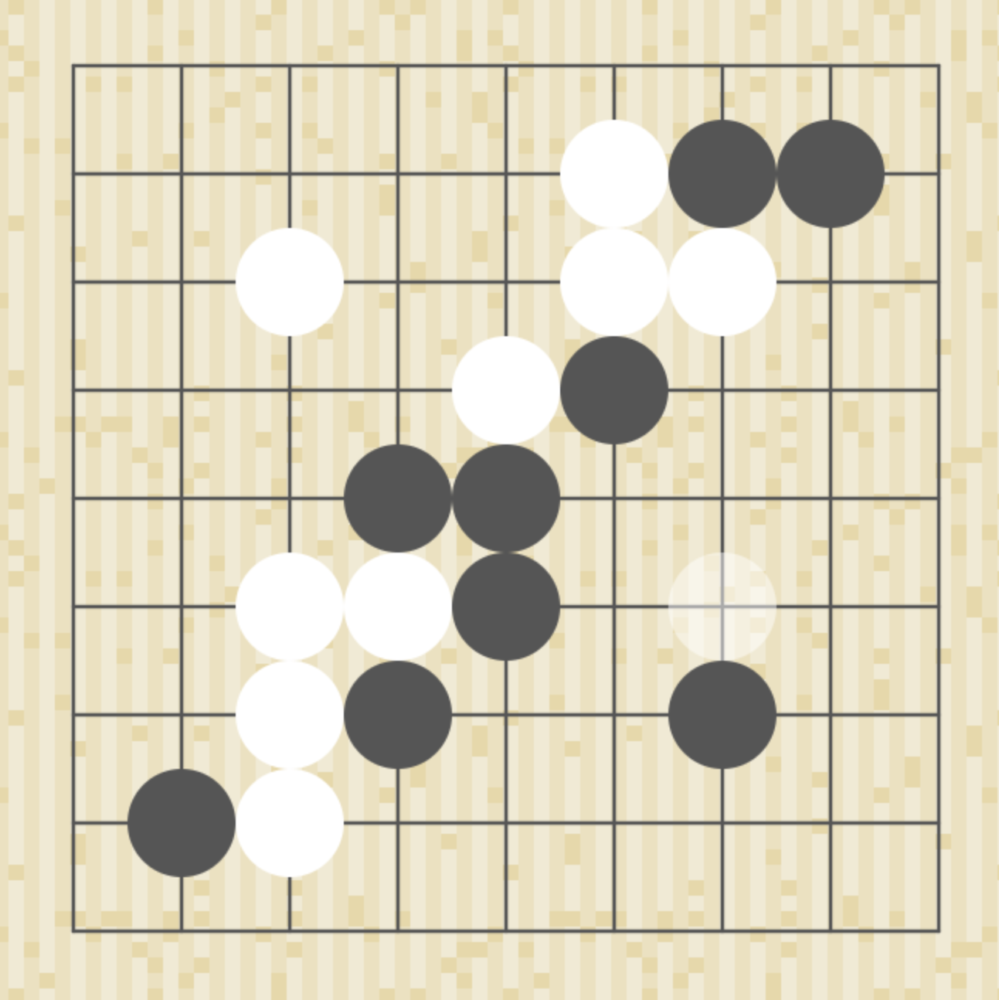

# Online Go Board

An interactive Go board with the ability to add/remove stones, optional alternating turn colour, undo/redo functionality, and a clear all button!

# Live Demo

Try the [live demo](https://strawstack.github.io/OnlineGoBoard/)

# Screenshot

# Todo

- [x] App state in JS object
- [x] App re-render on state change
- [x] Stone placement according to turn and state
- [x] Stone preview (with color) on hover
- [x] Disable undo/redo when not possible
- [x] Prompt to clear board on menu selection
- [ ] Share page state with [TogetherJS](https://togetherjs.com/) 
